# Phase 0 — Entity–Relationship Model

Target model (new system). Source: design spec §6. Mermaid renders in GitHub/VS Code; ASCII fallback at bottom.

## Diagram

```mermaid
erDiagram
    users ||--o{ user_roles : has
    roles ||--o{ user_roles : grants
    roles ||--o{ role_permissions : has
    permissions ||--o{ role_permissions : "granted to"
    users ||--o{ user_departments : "scoped by"
    departments ||--o{ user_departments : assigns
    users ||--o{ sessions : "logs in"
    users ||--o{ login_attempts : "rate-limited by"

    customers ||--o{ jobs : "orders"
    jobs ||--|| job_contact_snapshot : "frozen contact"
    jobs ||--|| job_dispatch_snapshot : "frozen dispatch"
    jobs ||--o{ job_lines : contains
    job_lines ||--o{ job_line_sizes : "size grid"
    job_lines }o--|| product_skus : "references"
    products ||--o{ product_skus : has
    jobs ||--o{ job_stages : "per department"
    departments ||--o{ job_stages : "defines"
    jobs ||--o| screen_records : "screens gate"
    jobs ||--o{ print_positions : "print positions"

    jobs ||--o{ stock_events : "history"
    job_lines ||--o{ stock_events : "history"
    jobs ||--o{ operational_audit : "audited"

    jobs ||--o| swatch_requirements : "gate"
    jobs ||--o{ swatch_attempts : "samples"
    swatch_attempts ||--o{ swatch_attempt_events : "actions"
    swatch_attempts ||--o{ swatch_assets : "photos"
    swatch_attempts ||--o{ operational_audit : "audited"

    jobs ||--o{ shipments : "part dispatch"
    shipments ||--o{ shipment_events : "actions"
    shipments ||--o{ shipment_attachments : "labels"
    jobs ||--o{ artworks : "artwork"
    artworks ||--o{ artwork_versions : "versions"
    artwork_versions ||--o{ artwork_assets : "files"
    artwork_versions ||--o{ artwork_events : "approvals"

    files ||--o{ artwork_assets : "stored in"
    files ||--o{ swatch_assets : "stored in"
    files ||--o{ shipment_attachments : "stored in"
    files ||--o{ import_batches : "source file"
    import_batches }o--o{ jobs : "creates (add-only)"
    integration_outbox }o--o{ jobs : "emitted from"
```



## Key cardinalities & rules

| Relationship | Rule |
|---|---|
| customers → jobs | 1:N; job stores **snapshot copies**, never FK-live values in header display (FK kept for reference only) |
| jobs → job_contact_snapshot / job_dispatch_snapshot | 1:1, PK = job_id — frozen at order entry |
| jobs → job_lines | 1:N; `legacy_id` = v11 `skuLines[].id` |
| job_lines → job_line_sizes | 1:N (size ∈ xs,s,m,l,xl,2xl,3xl,4xl,5xl); quantity grid |
| jobs → job_stages | 1:N, one per required department; `legacy_id` = v11 `stages[].id` |
| jobs → screen_records | 1:1; `required int NULL` — NULL = "blank = not yet specified" (never 0) |
| jobs → swatch_requirements | 1:1, PK = job_id |
| jobs → swatch_attempts | 1:N; `attempt_no` = array index+1 of v11 `swatch.attempts` |
| jobs → shipments | 1:N; `legacy_id` = v11 `dispatch.shipments[].id` |
| jobs → artworks | 1:1 MVP (v11 has single `artworkApproval` per job); version table gives N versions |
| jobs → stock_events | 1:N append-only; keyed by job + optional line (`legacy_id` = v11 `stockEvents[].id`) |
| jobs → operational_audit | 1:N append-only; source v11 `operationsEvents` |
| jobs → print_positions | 1:N; source v11 `positions[]` (names only; pieces = job qty) |
| import_batches → jobs | add-only; dedupe on `job_number` |
| integration_outbox | Xero/DPD events (post-MVP) |

## Invariants

1. UUID PK everywhere; human keys (`job_number`, `master_sku`) have UNIQUE constraints.
2. Migrated rows carry `legacy_id` (= v11 uuid string), UNIQUE per table.
3. `version int` on jobs, job_lines, job_stages, shipments, swatch_attempts, screen_records — optimistic locking scoped per sub-entity (spec §9).
4. Append-only: `stock_events`, `operational_audit` — app role INSERT+SELECT only; RLS `USING (false)` for UPDATE/DELETE.
5. `readiness_cache` (jobs) is derived — recomputed server-side only, never accepted from client.
6. Money columns (`buying_cost`, `unit_price`, `tax`) live on `job_lines`/`product_skus` and are stripped in serialisation for unprivileged roles.

## ASCII fallback

```
[roles]──<role_permissions>──[permissions]      [users]──<user_roles>──[roles]
   [users]──<sessions>                            [users]──<user_departments>──[departments]

[customers]──<jobs>──||[job_contact_snapshot]
                     ──||[job_dispatch_snapshot]
                     ──<job_lines>──<job_line_sizes>   job_lines}o──[product_skus]──[products]
                     ──<job_stages>──[departments]
                     ──||[screen_records]
                     ──<print_positions>
                     ──||[swatch_requirements]
                     ──<swatch_attempts>──<swatch_attempt_events> / <swatch_assets>
                     ──<shipments>──<shipment_events> / <shipment_attachments>
                     ──||[artworks]──<artwork_versions>──<artwork_assets>/<artwork_events>
                     ──<stock_events>        (append-only)
                     ──<operational_audit>   (append-only)

[files]──(artwork/swatch/shipment/import assets)
[import_batches] ──creates──> jobs (add-only, dedupe job_number)
[integration_outbox] <── jobs (post-MVP: dpd|xero)
```
